# Experiment 10: SonarQube

---

## Theory

### Problem Statement

Code quality issues such as bugs, vulnerabilities, and code smells are often discovered late in the development cycle, making them expensive to fix. Manual code reviews are inconsistent and don't scale.

### What is SonarQube?

SonarQube is an open-source platform for **continuous inspection of code quality**. It performs automatic reviews with static analysis to detect bugs, code smells, and security vulnerabilities.

### How SonarQube Solves the Problem

- **Continuous Inspection** — Scans code with every commit, providing immediate feedback
- **Quality Gates** — Defines pass/fail criteria for code quality
- **Technical Debt Quantification** — Measures effort needed to fix issues
- **Multi-language Support** — Supports 20+ programming languages
- **Visual Analytics** — Dashboard showing code quality metrics and trends

### Key Concepts

| Term | Meaning |
|---|---|
| **Quality Gate** | Set of conditions code must meet before deployment |
| **Technical Debt** | Estimated time to fix all issues |
| **Code Smells** | Maintainability issues that don't affect functionality |
| **Vulnerabilities** | Security-related issues |
| **Bugs** | Code that might break or behave unexpectedly |
| **Coverage** | Percentage of code covered by tests |
| **Duplications** | Repeated code blocks |

---

## Lab Architecture

```
┌─────────────────┐     HTTP      ┌──────────────────┐
│  Developer      │──────────────▶│  SonarQube       │
│  Machine        │               │  Server          │
│  (WSL2)         │               │  (Container)     │
└─────────────────┘               └──────────────────┘
        │                                │
        ▼                                ▼
┌─────────────────┐               ┌──────────────────┐
│  Application    │               │  PostgreSQL      │
│  Source Code    │               │  Database        │
│  (Java)         │               │  (Container)     │
└─────────────────┘               └──────────────────┘
```

---

## Step 1: Setup SonarQube Environment

### Create Docker Network and Start PostgreSQL + SonarQube

```bash
docker network create sonarqube-lab

docker run -d \
  --name sonar-db \
  --network sonarqube-lab \
  -e POSTGRES_USER=sonar \
  -e POSTGRES_PASSWORD=sonar \
  -e POSTGRES_DB=sonarqube \
  -v sonar-db-data:/var/lib/postgresql/data \
  postgres:13

docker run -d \
  --name sonarqube \
  --network sonarqube-lab \
  -p 9000:9000 \
  -e SONAR_JDBC_URL=jdbc:postgresql://sonar-db:5432/sonarqube \
  -e SONAR_JDBC_USERNAME=sonar \
  -e SONAR_JDBC_PASSWORD=sonar \
  -v sonar-data:/opt/sonarqube/data \
  -v sonar-extensions:/opt/sonarqube/extensions \
  sonarqube:lts-community
```

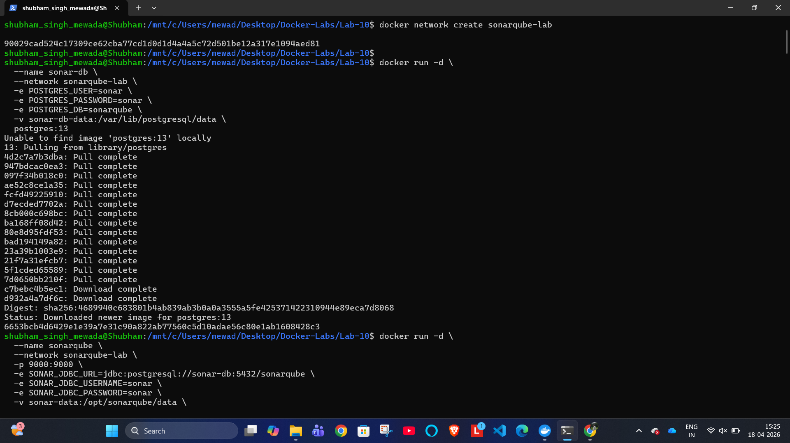

---

### SonarQube Server Logs

```bash
docker logs -f sonarqube
```

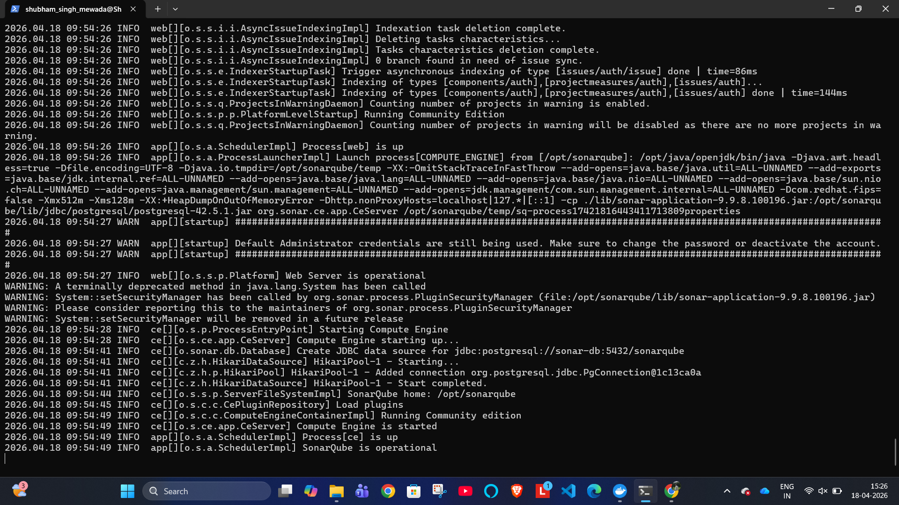

---

### Login to SonarQube

Access SonarQube at `http://localhost:9000`. Default credentials: `admin / admin`

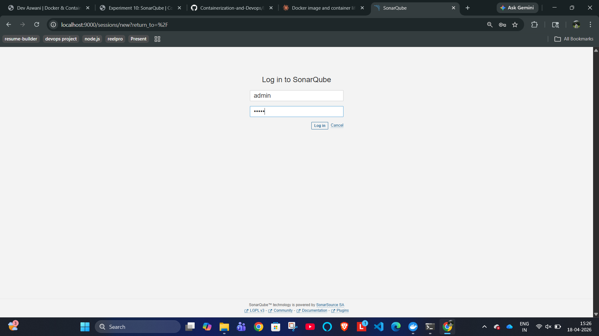

---

### Create Project

After login, select **Manually** to create a new project:

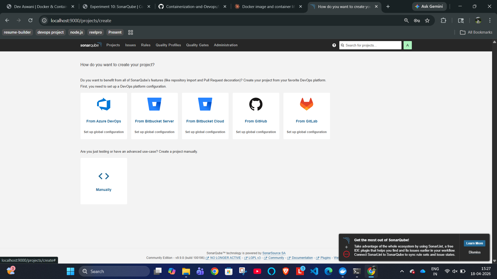

---

## Step 2: Install Java and Create Sample Application

### Install OpenJDK 17 and Create Calculator.java

```bash
sudo apt update
sudo apt install openjdk-17-jdk -y
javac -version
mkdir -p sample-java-app/src/main/java/com/example
cat > sample-java-app/src/main/java/com/example/Calculator.java << 'EOF'
...
EOF
```

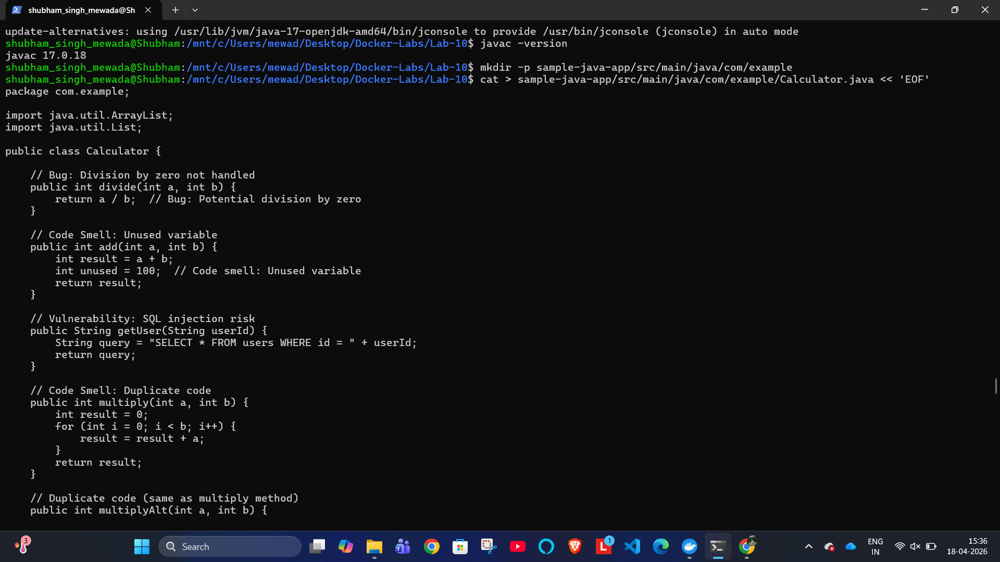

---

### Create pom.xml and Download SonarScanner

```bash
cat > sample-java-app/pom.xml << 'EOF'
...
EOF

wget https://binaries.sonarsource.com/Distribution/sonar-scanner-cli/sonar-scanner-cli-5.0.1.3006-linux.zip
sudo apt install unzip -y
```

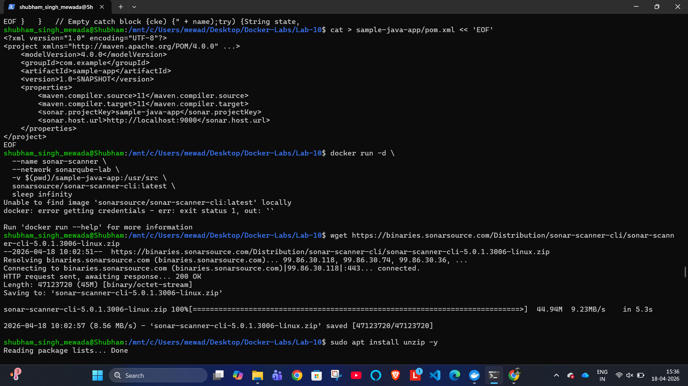

---

## Step 3: Install SonarQube Scanner

### Unzip Scanner

```bash
unzip sonar-scanner-cli-5.0.1.3006-linux.zip
```

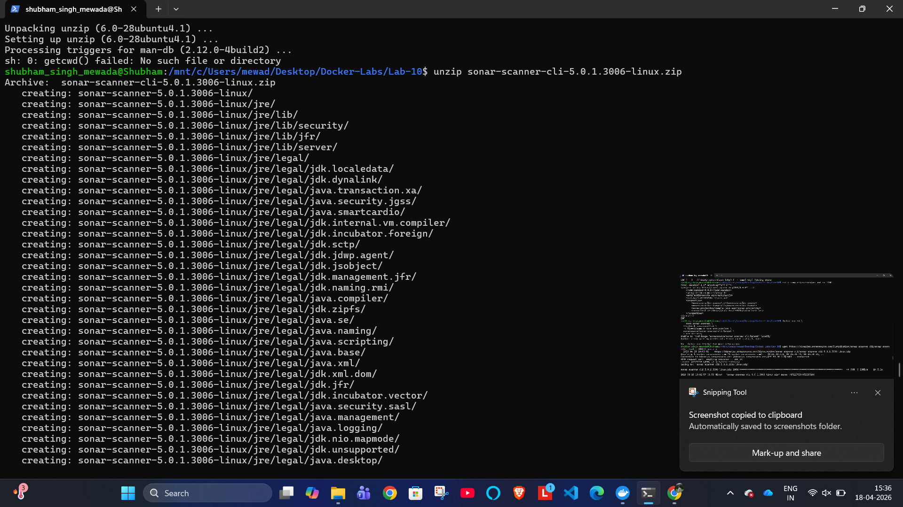

---

### Install Scanner and Fix WSL Path Issue

```bash
sudo mv sonar-scanner-5.0.1.3006-linux /opt/sonar-scanner
export PATH=$PATH:/opt/sonar-scanner/bin

# Fix: move to WSL native path to avoid JVM error
cd ~
cp -r /mnt/c/Users/mewad/Desktop/Docker-Labs/Lab-10 ~/Lab-10
cd ~/Lab-10
sonar-scanner -v
```

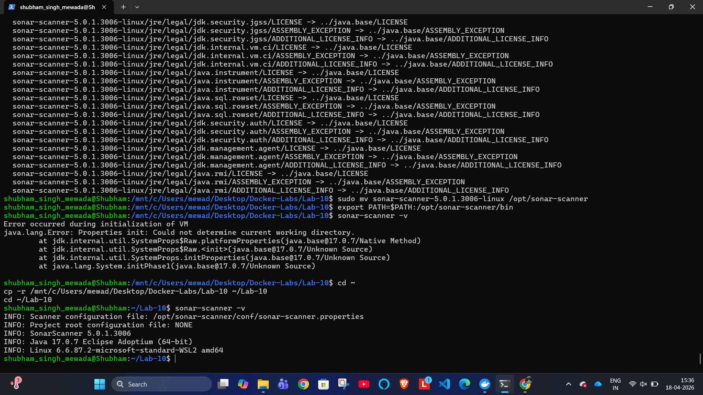

---

## Step 4: Generate SonarQube Token

In SonarQube:
```
Administrator → My Account → Security → Generate Token
```

- Token Name: `sonar-token`
- Type: User
- Created: April 18, 2026
- Expires: May 18, 2026
- Generated: `squ_18721aee14728cd02612222ba53ba6f34106dd9c`

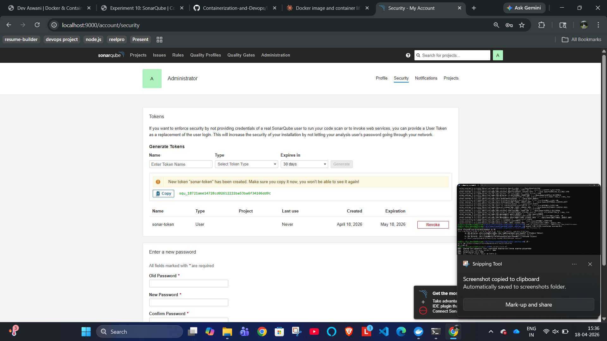

---

## Step 5: Configure and Run SonarQube Analysis

### Create sonar-project.properties, Compile and Scan

```bash
cat > sample-java-app/sonar-project.properties << 'EOF'
sonar.projectKey=sample-java-app
sonar.projectName=Sample Java Application
sonar.projectVersion=1.0
sonar.sources=src
sonar.java.binaries=target/classes
sonar.language=java
sonar.sourceEncoding=UTF-8
EOF

cd sample-java-app
javac -d target/classes src/main/java/com/example/Calculator.java

sonar-scanner \
  -Dsonar.host.url=http://localhost:9000 \
  -Dsonar.login="squ_18721aee14728cd02612222ba53ba6f34106dd9c"
```

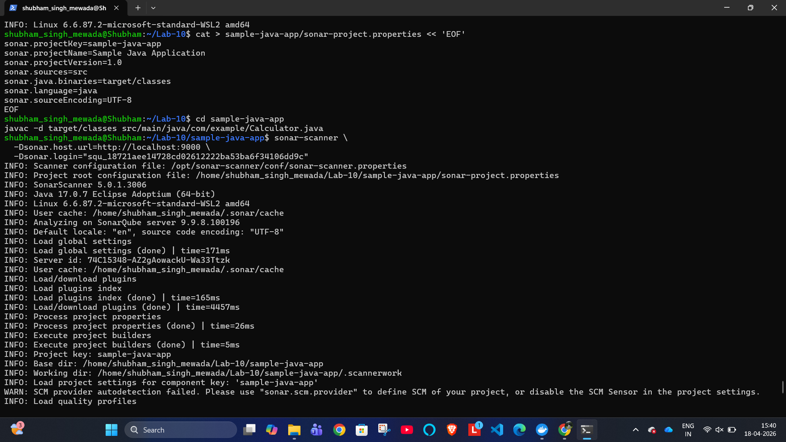

---

## Step 6: Fetch Issues via API

```bash
curl -u squ_18721aee14728cd02612222ba53ba6f34106dd9c: \
  "http://localhost:9000/api/issues/search?projectKeys=sample-java-app"
```

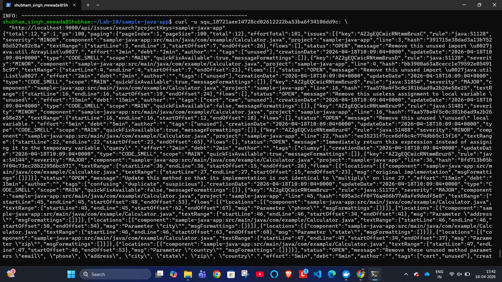

---

## Result

Successfully implemented SonarQube static code analysis:

- ✅ Created Docker network `sonarqube-lab` with PostgreSQL + SonarQube containers
- ✅ Accessed SonarQube at `localhost:9000` and logged in as admin
- ✅ Installed OpenJDK 17 (`javac 17.0.18`) and created `Calculator.java` with intentional issues
- ✅ Installed SonarScanner 5.0.1.3006 locally (fixed WSL path issue)
- ✅ Generated SonarQube token (`sonar-token`)
- ✅ Ran scan — detected **12 issues** (Bugs, Code Smells)
- ✅ Fetched all issues via SonarQube REST API

---

## Conclusion

SonarQube provides powerful **automated static code analysis** that detects code quality issues early in the development cycle. By integrating SonarQube with Docker and running it against a sample Java application, this experiment demonstrated how bugs, code smells, and duplicate code can be automatically identified and quantified, enabling developers to maintain high code quality standards consistently.

---

## Comparative Summary

| Feature | Jenkins | Ansible | SonarQube |
|---|---|---|---|
| Primary Purpose | CI/CD Automation | Configuration Management | Code Quality Analysis |
| Architecture | Master-Agent | Push-based, Agentless | Client-Server |
| Language | Java, Groovy | Python, YAML | Java |
| Learning Curve | Moderate | Low | Low |
| Use Case | Build, Test, Deploy | Infrastructure as Code | Static Code Analysis |
