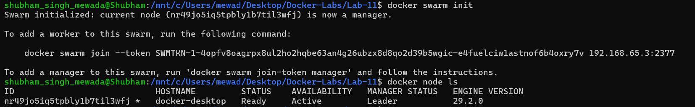
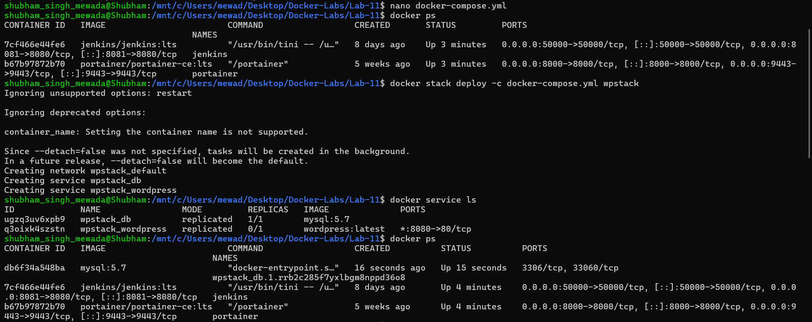
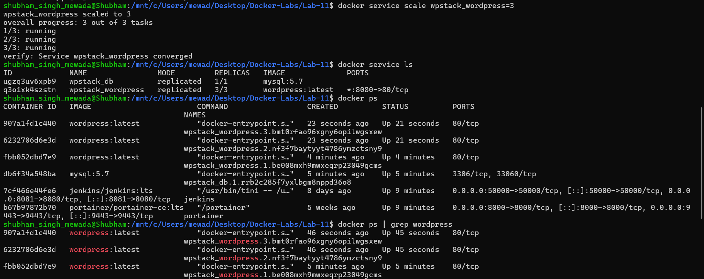
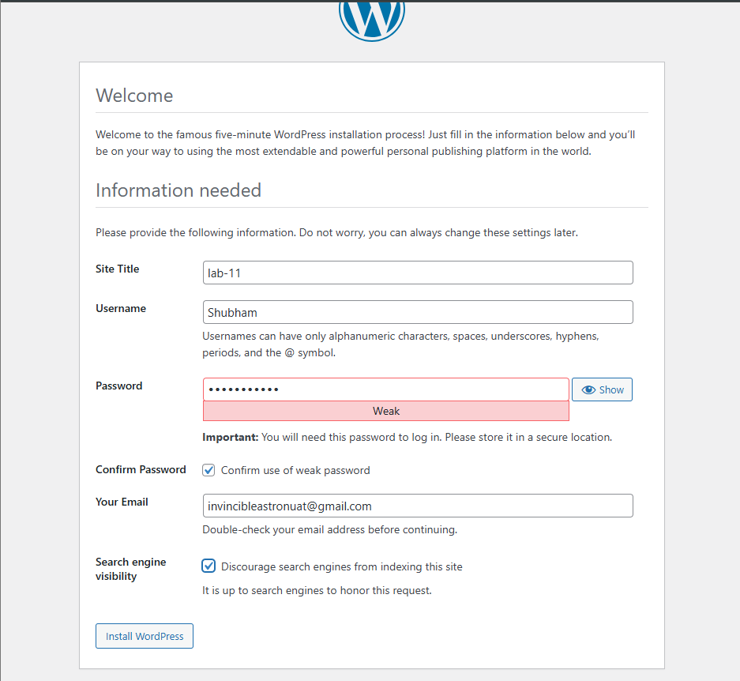
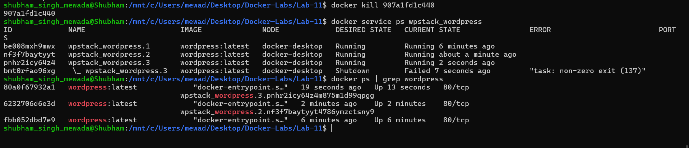

# Experiment 11: Orchestration using Docker Compose & Docker Swarm

---

## PART A – CONCEPT CONTINUATION

## From Experiment 6, you already know:

| Tool | What it does | Limitation |
|------|--------------|------------|
| `docker run` | Runs a single container | Manual, no coordination |
| Docker Compose | Runs multiple containers together | Single machine, no auto-healing |

## New Concept: Orchestration

**Orchestration** = Automatic management of containers

Think of it like a **restaurant manager**:
- Decides how many waiters are needed (scaling)
- Replaces a sick waiter immediately (self-healing)
- Distributes customers evenly (load balancing)

### What Orchestration Adds:

| Feature | What it means |
|---------|---------------|
| Scaling | Increase/decrease number of containers |
| Self-healing | Restart failed containers automatically |
| Load balancing | Distribute traffic across containers |
| Multi-host | Run containers across multiple machines |

---

## The Progression Path

```
docker run  →  Docker Compose  →  Docker Swarm  →  Kubernetes
   │               │                  │                │
Single container  Multi-container    Orchestration    Advanced
                 (single host)       (basic)         orchestration
```

> **This experiment focuses on:** Moving from Compose → Swarm

---

## PART B – PRACTICAL

## Task 1: Initialize Docker Swarm

```bash
docker swarm init
docker node ls
```



---

## Task 2: Deploy as a Stack and Verify

```bash
nano docker-compose.yml
docker stack deploy -c docker-compose.yml wpstack
docker service ls
docker ps
```



---

## Task 3: Scale the Application

```bash
docker service scale wpstack_wordpress=3
docker service ls
docker ps
docker ps | grep wordpress
```



---

## Task 4: Access WordPress

Open browser at `http://localhost:8080` and complete WordPress setup:

- Site Title: `lab-11`
- Username: `Shubham`




---

## Task 5: Test Self-Healing

```bash
docker kill 907a1fd1c440
docker service ps wpstack_wordpress
docker ps | grep wordpress
```



---

## PART C – ANALYSIS (Compose vs Swarm)

| Feature | Docker Compose | Docker Swarm |
|---------|----------------|--------------|
| **Scope** | Single host only | Multi-node cluster |
| **Scaling** | `--scale` flag (no load balancing) | `docker service scale` (built-in) |
| **Load Balancing** | No (port conflicts) | Yes (internal LB) |
| **Self-Healing** | No (must restart manually) | Yes (automatic) |
| **Rolling Updates** | No | Yes (zero downtime) |
| **Service Discovery** | Via container names | Via DNS + VIP |
| **Use Case** | Development, testing | Simple production clusters |
| **Complexity** | Low | Medium |

---

## PART D – Key Observations

### Observation 1: Compose File Reuse

| Command | Mode |
|---------|------|
| `docker compose up -d` | Compose (single host, no orchestration) |
| `docker stack deploy` | Swarm (orchestration enabled) |

### Observation 2: Containers vs Services

| Concept | Meaning |
|---------|---------|
| **Container** | A single running instance |
| **Service** | A definition of how to run containers (image, replicas, etc.) |

### Observation 3: The Port Mystery Solved

- In Compose, scaling WordPress to 3 would **fail** due to port conflicts
- In Swarm, the load balancer listens on port 8080 **once** and distributes traffic to all 3 containers internally — no port conflicts!

---

## Quick Reference

```bash
# Initialize Swarm
docker swarm init

# Deploy stack
docker stack deploy -c docker-compose.yml <stack-name>

# List services
docker service ls

# Scale service
docker service scale <stack-name_service-name>=<replicas>

# See service tasks
docker service ps <service-name>

# Remove stack
docker stack rm <stack-name>

# Leave Swarm
docker swarm leave --force
```

---

## Result

- ✅ Docker Swarm initialized — node `docker-desktop` set as Leader
- ✅ WordPress + MySQL stack deployed using `docker stack deploy`
- ✅ WordPress scaled to 3 replicas with built-in load balancing
- ✅ WordPress accessible at `localhost:8080` and successfully installed
- ✅ Self-healing verified — killed container was automatically recreated by Swarm

---

## Conclusion

This experiment demonstrated the progression from Docker Compose to Docker Swarm for container orchestration. Swarm adds automatic scaling, self-healing, and load balancing on top of the same `docker-compose.yml` file used in Experiment 6, making it suitable for simple production deployments where high availability is required.

| You started with | You can now do |
|------------------|----------------|
| Single container (`docker run`) | Multi-container (Compose) |
| Manual scaling | One-command scaling (`scale`) |
| Manual recovery | Automatic self-healing |
| Single host | Multi-host cluster ready |

> **Compose defines the application. Swarm runs it reliably.**
