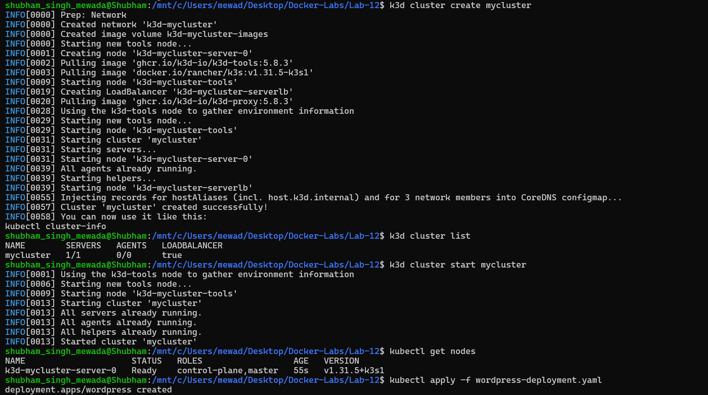
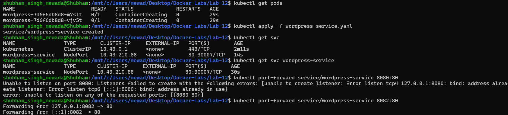
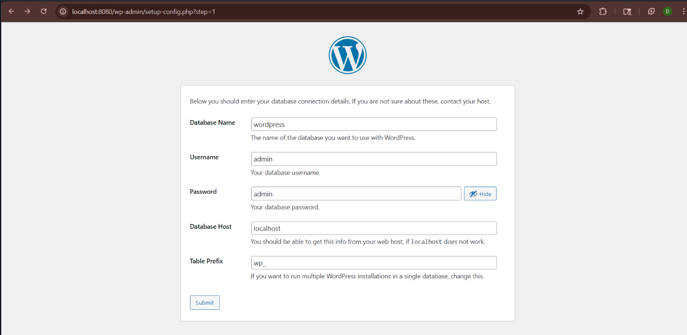
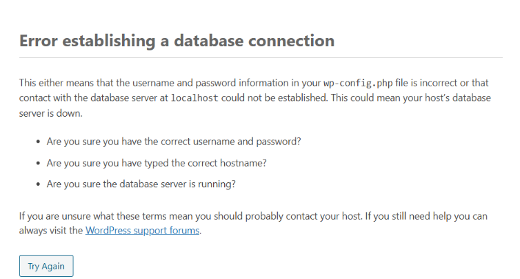
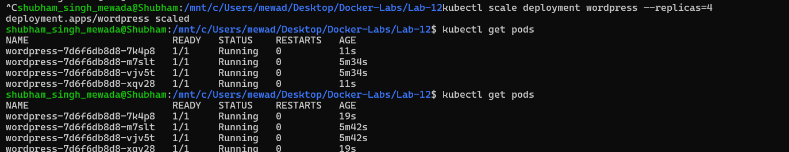
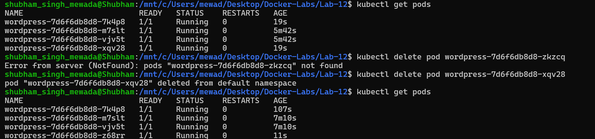
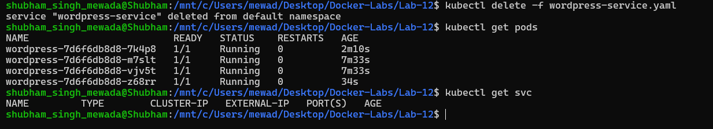

# Experiment 12: Container Orchestration using Kubernetes

## Objective
To study and analyse container orchestration using Kubernetes — deploying a WordPress application, exposing it via a Service, scaling pods, and demonstrating self-healing using `kubectl` on a k3d cluster.

---

## Theory

### Why Kubernetes over Docker Swarm?

| Reason | Explanation |
|--------|-------------|
| Industry Standard | Most companies use Kubernetes in production |
| Powerful Scheduling | Automatically decides where to run containers |
| Large Ecosystem | Monitoring, logging, auto-scaling tools available |
| Cloud-Native | Works on AWS, GCP, Azure natively |

### Core Kubernetes Concepts

| Docker Concept | Kubernetes Equivalent | Meaning |
|----------------|----------------------|---------|
| Container | Pod | Smallest deployable unit; one or more containers |
| Compose service | Deployment | Defines how to run pods (image, replicas) |
| Load balancing | Service | Exposes pods with a stable IP/port |
| Scaling | ReplicaSet | Ensures desired number of pod copies always run |

---

## YAML Configuration Files

### wordpress-deployment.yaml
```yaml
apiVersion: apps/v1
kind: Deployment
metadata:
  name: wordpress
spec:
  replicas: 2
  selector:
    matchLabels:
      app: wordpress
  template:
    metadata:
      labels:
        app: wordpress
    spec:
      containers:
      - name: wordpress
        image: wordpress:latest
        ports:
        - containerPort: 80
```

### wordpress-service.yaml
```yaml
apiVersion: v1
kind: Service
metadata:
  name: wordpress-service
spec:
  type: NodePort
  selector:
    app: wordpress
  ports:
    - port: 80
      targetPort: 80
      nodePort: 30007
```

---

## Procedure

### Task 1: Create Cluster, Start & Deploy

```bash
k3d cluster create mycluster
k3d cluster list
k3d cluster start mycluster
kubectl get nodes
kubectl apply -f wordpress-deployment.yaml
```



**Observation:**
- `k3d cluster create mycluster` creates tools node, server node, and load balancer
- `k3d cluster list` shows `mycluster` with `1/1` servers and load balancer enabled
- `kubectl get nodes` confirms `k3d-mycluster-server-0` is `Ready` with role `control-plane,master` running Kubernetes `v1.31.5+k3s1`
- `kubectl apply -f wordpress-deployment.yaml` → `deployment.apps/wordpress created`

---

### Task 2: Verify Pods, Apply Service & Port-Forward

```bash
kubectl get pods
kubectl apply -f wordpress-service.yaml
kubectl get svc
kubectl get svc wordpress-service
kubectl port-forward service/wordpress-service 8082:80
```



**Observation:**
- 2 WordPress pods initially in `ContainerCreating` state
- Service `wordpress-service` created as `NodePort` on `10.43.210.88`, port `80:30007/TCP`
- Port 8080 was already in use — port-forwarded on `8082` instead
- `Forwarding from 127.0.0.1:8082 → 80` active

---

### Task 3: Access WordPress in Browser

Opened browser at `http://localhost:8080`



**Observation:** WordPress database setup page is accessible at `localhost:8080`, confirming the deployment and service are working correctly.

---

### Task 4: Database Connection Error (Expected)

Submitted the database form with `localhost` as Database Host.



**Observation:** WordPress throws `Error establishing a database connection`.

> **Reason:** No MySQL database pod or service was deployed in this experiment. WordPress requires a running MySQL instance, but since only the WordPress deployment was created, the connection to `localhost` fails — confirming that a multi-tier architecture is needed.

---

### Task 5: Scale the Deployment

```bash
kubectl scale deployment wordpress --replicas=4
kubectl get pods
```



**Observation:**
- `deployment.apps/wordpress scaled` confirms command executed successfully
- `kubectl get pods` shows 4 WordPress pods all in `1/1 Running` state
- 2 original pods (`m7slt`, `vjv5t`) + 2 newly created pods (`7k4p8`, `xqv28`)
- Kubernetes scaled from 2 → 4 replicas instantly

---

### Task 6: Self-Healing Demonstration

```bash
kubectl get pods
kubectl delete pod wordpress-7d6f6db8d8-xqv28
kubectl get pods
```



**Observation:**
- Pod `wordpress-7d6f6db8d8-xqv28` was manually deleted
- Kubernetes immediately detected replica count dropped below 4
- A new pod `wordpress-7d6f6db8d8-z68rr` was automatically created (AGE: 11s)
- Final `kubectl get pods` still shows **4 running pods** — self-healing confirmed

---

### Task 7: Cleanup

```bash
kubectl delete -f wordpress-service.yaml
kubectl get pods
kubectl get svc
```



**Observation:**
- `service "wordpress-service" deleted` from default namespace
- `kubectl get pods` — 4 WordPress pods still running after service deletion
- `kubectl get svc` — `wordpress-service` gone; only `kubernetes` service remains

---

## Result

| Task | Command | Result |
|------|---------|--------|
| Create & Start Cluster | `k3d cluster create mycluster` | Cluster ready, node Ready |
| Create Deployment | `kubectl apply -f wordpress-deployment.yaml` | 2 WordPress pods running |
| Expose Service | `kubectl apply -f wordpress-service.yaml` | NodePort service on port 30007 |
| Access App | Browser at `localhost:8080` | WordPress setup page loaded |
| DB Error (Expected) | — | Confirms multi-tier architecture needed |
| Scale | `kubectl scale deployment wordpress --replicas=4` | 4/4 pods running |
| Self-Healing | `kubectl delete pod <name>` | Pod auto-replaced, count stays at 4 |
| Cleanup | `kubectl delete -f` | Service removed |

---

## Docker Swarm vs Kubernetes

| Feature | Docker Swarm | Kubernetes |
|---------|-------------|------------|
| Setup | Very easy | More complex |
| Scaling | Basic | Advanced (supports auto-scaling) |
| Ecosystem | Small | Huge (monitoring, logging, service mesh) |
| Industry Use | Rare | Industry standard |
| Cloud Support | Limited | Native on AWS, GCP, Azure |

---

## Quick Reference

```bash
kubectl apply -f <file.yaml>                         # Create resource from YAML
kubectl get pods                                     # List all pods
kubectl get svc                                      # List all services
kubectl get nodes                                    # List cluster nodes
kubectl scale deployment <name> --replicas=N         # Scale a deployment
kubectl delete pod <pod-name>                        # Delete a specific pod
kubectl delete -f <file.yaml>                        # Delete resource from YAML
kubectl port-forward service/<svc-name> 8080:80      # Forward local port to service
```

---

## Conclusion

This experiment demonstrated container orchestration using Kubernetes on a k3d cluster. Key Kubernetes features — deployment, service exposure, scaling, and self-healing — were successfully verified. The database connection error confirmed that production-grade applications require multi-tier deployments with separate database pods and services, unlike single-container setups.
