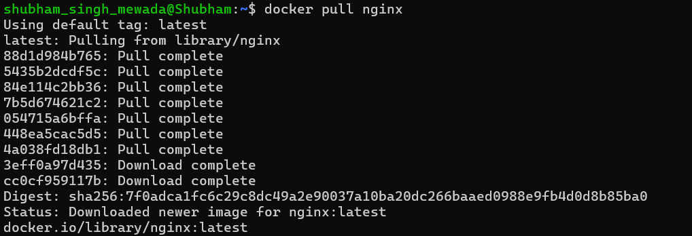
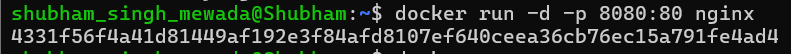
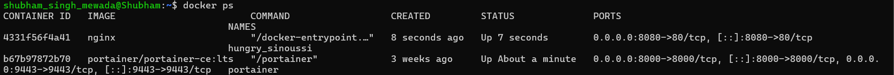
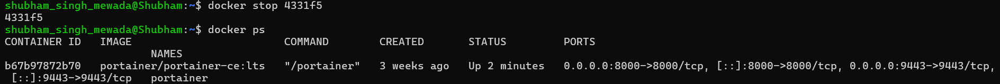
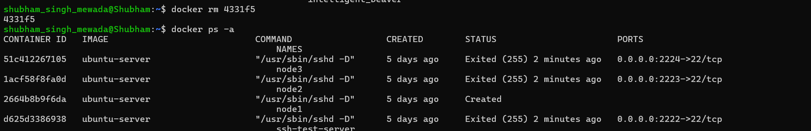
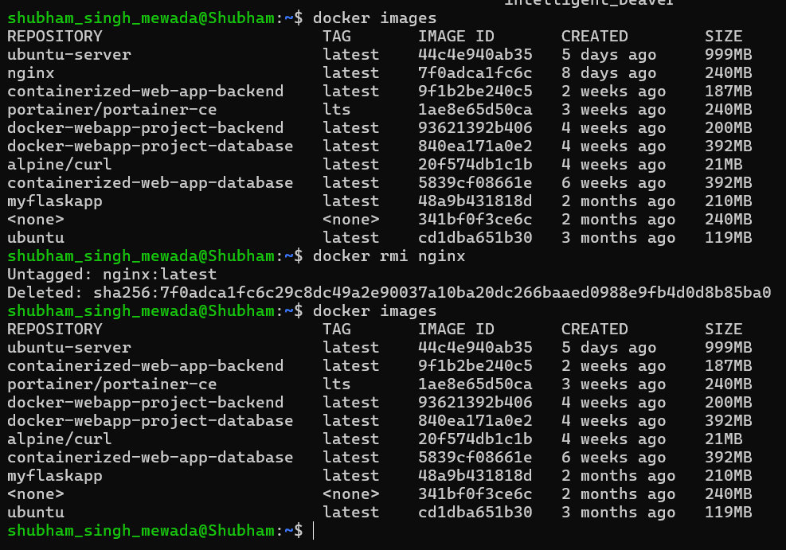

# Experiment 2
## Docker Installation, Configuration, and Running Images

---

## Objective
- Pull Docker images
- Run containers
- Manage container lifecycle

---

## Steps

### 1. Pulled Nginx Image from Docker Hub

### 2. Ran Nginx Container with Port Mapping

### 3. Verified Running Containers

### 4. Stopped the Running Container

### 5. Removed the Stopped Container

### 6. Removed Nginx Image from System

---

## Result
Docker images were successfully pulled, containers executed, and lifecycle operations were performed.

---

## Overall Conclusion
This experiment demonstrated basic Docker image handling and container lifecycle management, including pulling images, running containers with port mapping (`8080:80`), verifying container status, stopping containers, and removing both containers and images from the system.
