# Experiment 4: Dockerfile for Web App Containerization

---

## Part 1: Flask App with Dockerfile (Automated Method)

### Steps
- Created a Dockerfile to automate container setup
- Used `python:3.11-slim` as base image
- Set working directory inside container to `/app`
- Installed dependencies using `requirements.txt`
- Copied application source code
- Exposed port `5000`
- Built Docker image using Dockerfile
- Ran container from the built image
- Verified application using `curl` and browser
- Viewed container logs and managed container lifecycle

### 1. Build Docker Image (`myflaskapp`)

```
docker build -t myflaskapp .
```

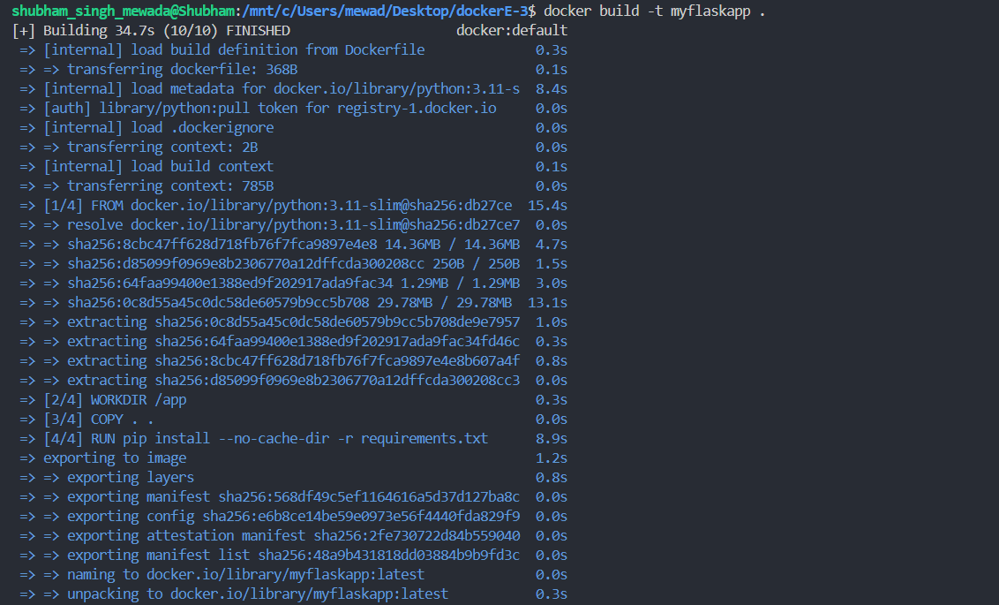

### 2. Run Flask Container with Port Mapping

```
docker run -d -p 8080:5000 myflaskapp
```

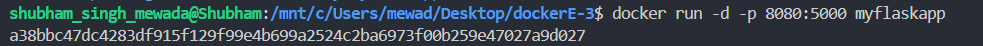

### 3. Verify Docker Images

```
docker images
```

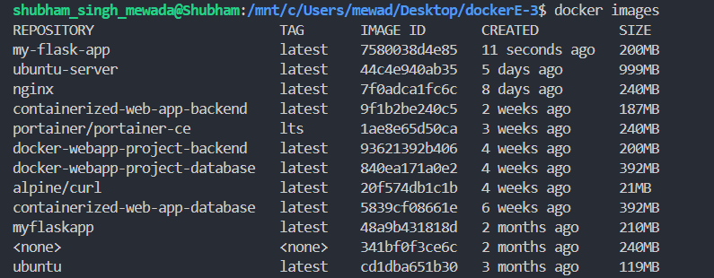

### 4. Build Versioned Image (`my-flask-app:1.0`)

```
docker build -t my-flask-app:1.0 .
```

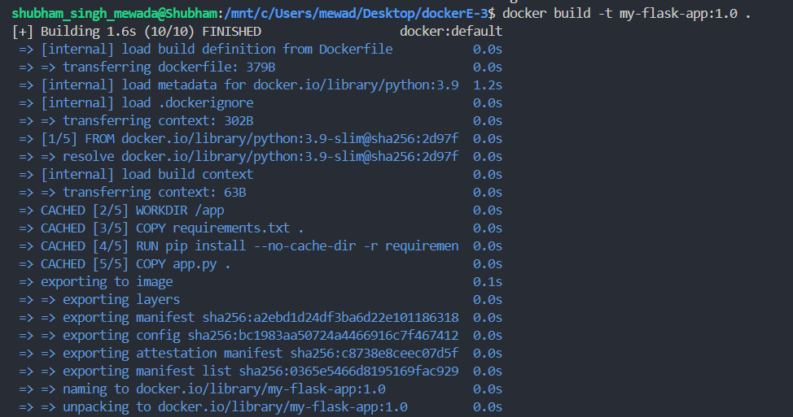

### 5. Build with Multiple Tags (`latest` and `1.0`)

```
docker build -t my-flask-app:latest -t my-flask-app:1.0 .
```

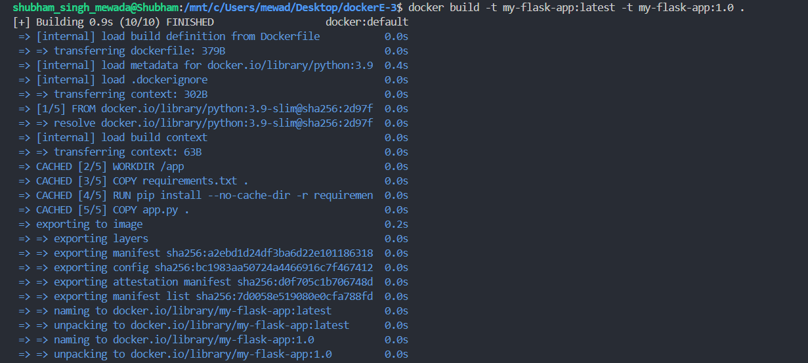

### 6. Build with Username Tag for Docker Hub

```
docker build -t username/my-flask-app:1.0 .
```

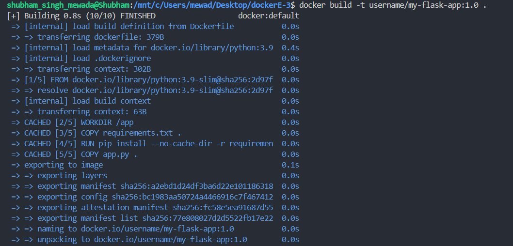

### 7. Tag Image and Verify All Tags

```
docker tag my-flask-app:latest my-flask-app:v1.0
docker images
```

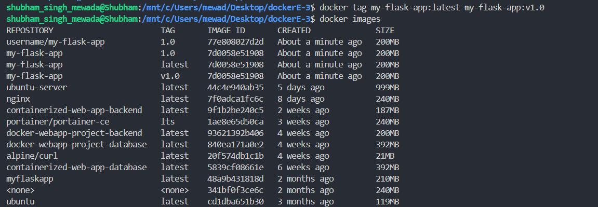

### 8. View Image Layer History

```
docker history my-flask-app
```

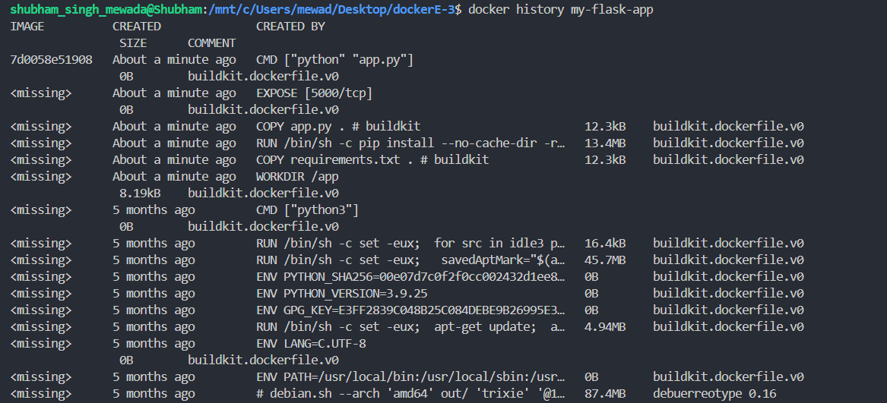

### 9. Inspect Image Metadata

```
docker inspect my-flask-app
```

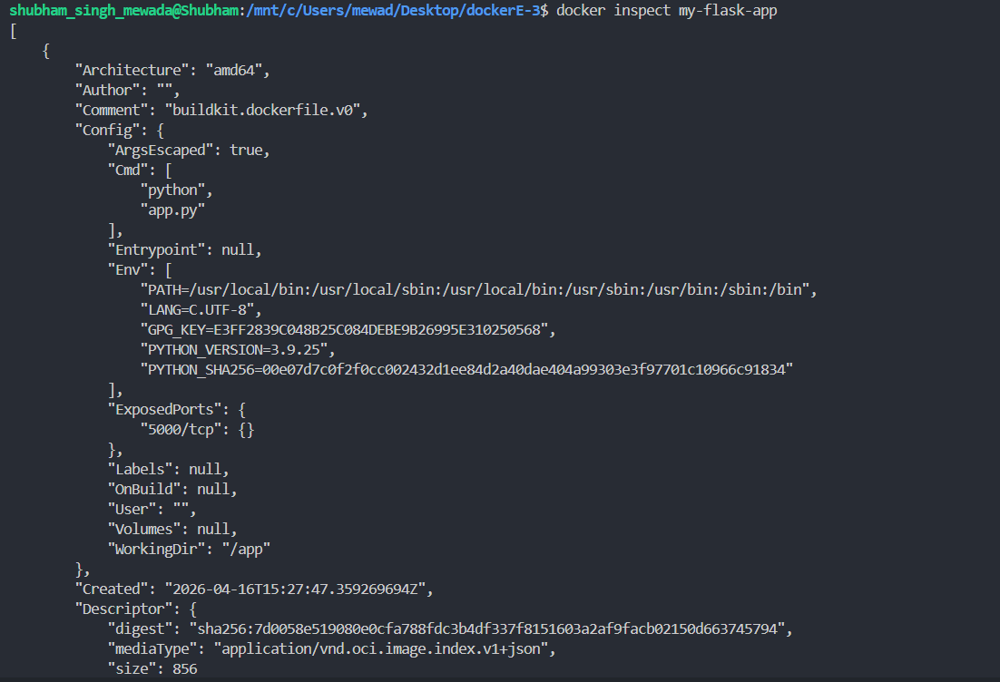

### 10. Run Container, View Logs, and Manage Lifecycle

```
docker run -d -p 5000:5000 --name flask-container my-flask-app
curl http://localhost:5000
docker ps
docker logs flask-container
docker stop flask-container
docker start flask-container
```

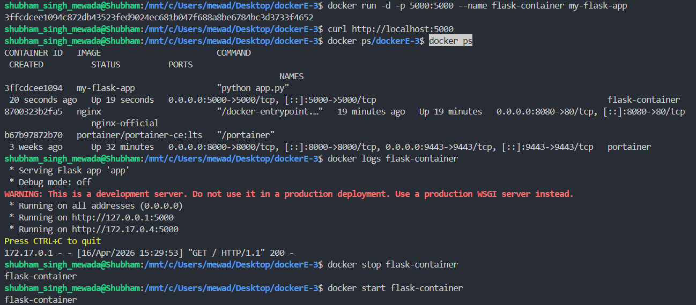

### 11. Docker Login

```
docker login
```

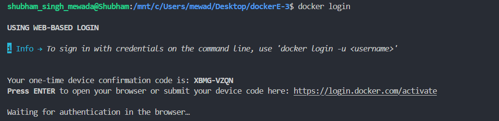

### 12. Tag and Push Image to Docker Hub

```
docker tag my-flask-app:latest username/my-flask-app:1.0
docker tag my-flask-app:latest username/my-flask-app:latest
docker push username/my-flask-app:1.0
```

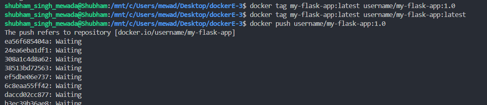

---

## Part 2: Node.js App with Dockerfile

### Steps
- Created a Node.js project directory (`lab-4-p2`)
- Added `app.js` with a basic HTTP server
- Added `package.json` with dependencies
- Created Dockerfile using `node:18-alpine` as base image
- Built Docker image
- Ran container and verified with `curl`

### 1. Build Node.js Docker Image

```
docker build -t my-node-app .
```

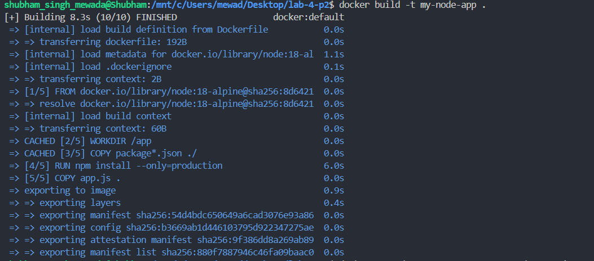

### 2. Run Node Container and Verify

```
docker run -d -p 3000:3000 --name node-container my-node-app
curl http://localhost:3000
```

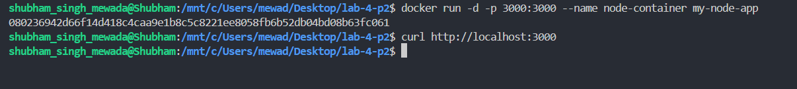

---

## Comparison: Manual vs Dockerfile Approach

**Manual Method**
- Helpful for understanding Docker internals
- Time-consuming and not repeatable

**Dockerfile Method**
- Fully automated and repeatable
- Recommended for real-world projects
- Easy to version control and share

---

## Key Takeaways
- Docker containers package application and dependencies together
- Dockerfile automates manual container steps
- Port mapping is required to access container services
- Multi-tag builds allow versioning and Docker Hub publishing
- Dockerfile-based workflow is best for production and collaboration
