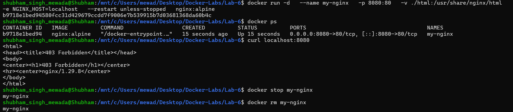
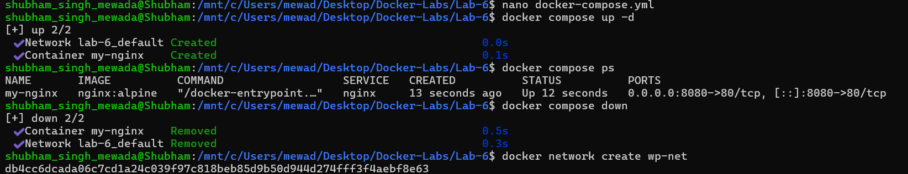
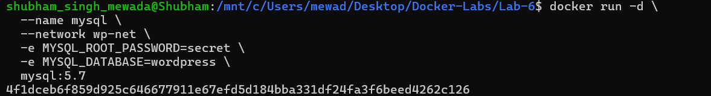
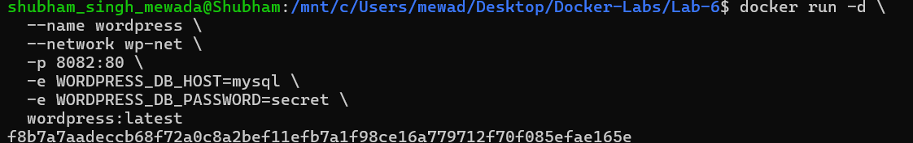
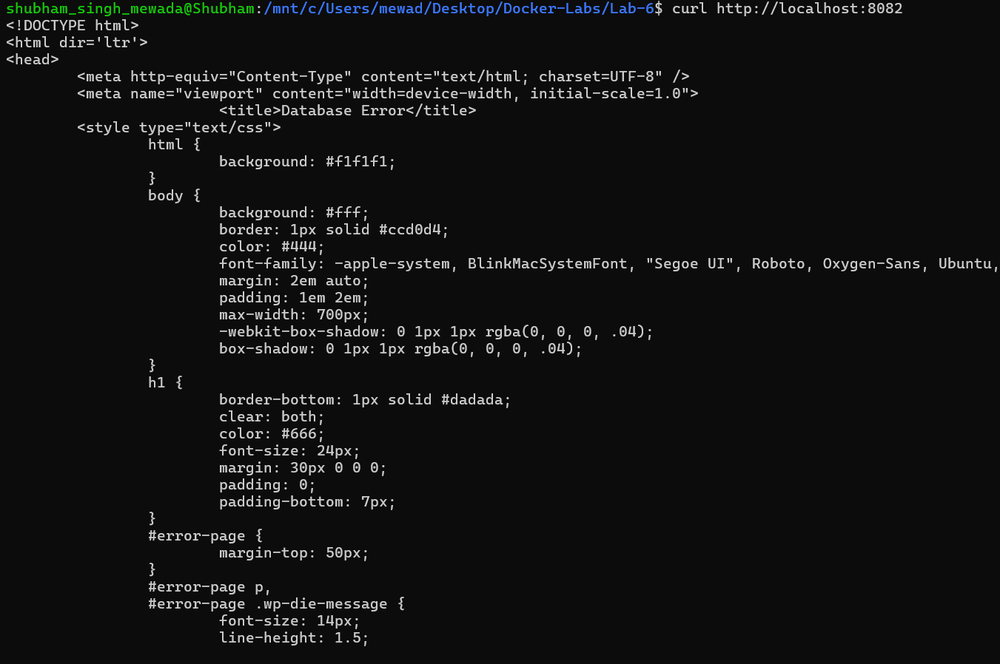
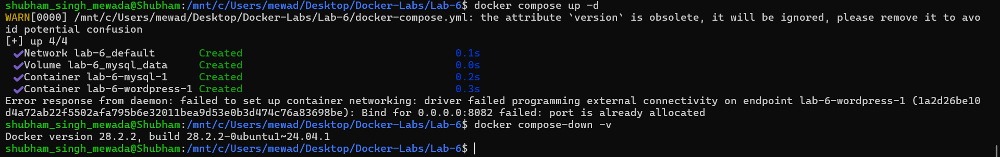
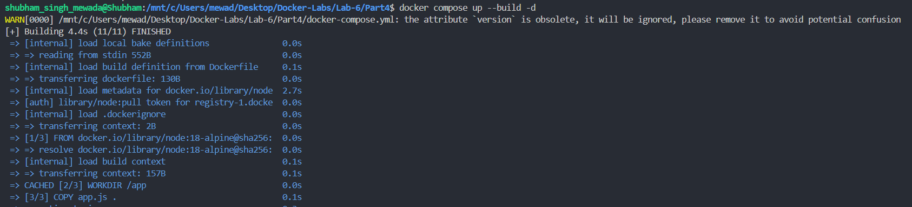
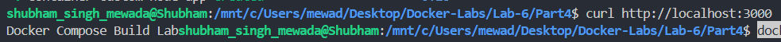
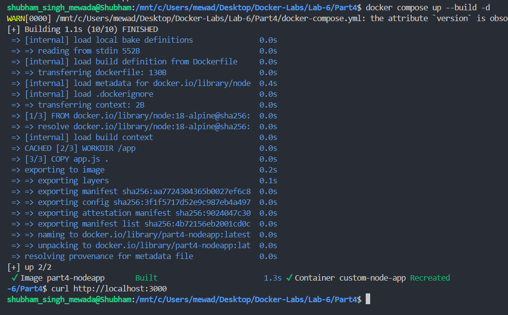
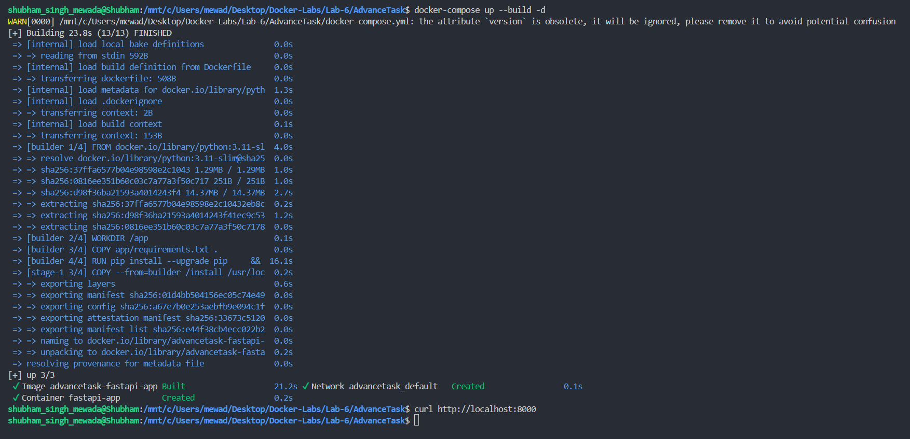

# Experiment 6: Comparison of Docker Run and Docker Compose

---

## PART A – THEORY

### Docker Run vs Docker Compose – Theory Summary

#### 1. Objective

The objective of this experiment is to understand the relationship between `docker run` and Docker Compose, and to compare their configuration style, syntax, and practical use cases in containerized environments.

---

#### 2. Background Theory

#### 2.1 Docker Run – Imperative Approach

The `docker run` command is used to create and start a container directly from an image. It follows an imperative approach, meaning the user provides step-by-step instructions every time a container is created.

When using `docker run`, we manually specify configuration options such as:
- Port mapping (`-p`)
- Volume mounting (`-v`)
- Environment variables (`-e`)
- Network configuration (`--network`)
- Restart policies (`--restart`)
- Resource limits (`--memory`, `--cpus`)
- Container name (`--name`)
- Detached mode (`-d`)

Example:
```bash
docker run -d \
  --name my-nginx \
  -p 8080:80 \
  -v ./html:/usr/share/nginx/html \
  -e NGINX_HOST=localhost \
  --restart unless-stopped \
  nginx:alpine
```

---

#### 2.2 Docker Compose – Declarative Approach

Docker Compose uses a YAML configuration file (`docker-compose.yml`) to define services, networks, volumes, and environment variables in a structured format.

Instead of running multiple `docker run` commands, a single command is used:
```bash
docker compose up -d
```

Equivalent Compose configuration:
```yaml
version: '3.8'

services:
  nginx:
    image: nginx:alpine
    container_name: my-nginx
    ports:
      - "8080:80"
    volumes:
      - ./html:/usr/share/nginx/html
    environment:
      NGINX_HOST: localhost
    restart: unless-stopped
```

---

#### 3. Mapping: Docker Run vs Docker Compose

| Docker Run Flag | Docker Compose Equivalent |
|----------------|--------------------------|
| `-p 8080:80` | `ports:` |
| `-v host:container` | `volumes:` |
| `-e KEY=value` | `environment:` |
| `--name` | `container_name:` |
| `--network` | `networks:` |
| `--restart` | `restart:` |
| `--memory` | `deploy.resources.limits.memory` |
| `--cpus` | `deploy.resources.limits.cpus` |
| `-d` | `docker compose up -d` |

---

#### 4. Advantages of Docker Compose

- Simplifies multi-container application management
- Ensures reproducibility across environments
- Allows configuration to be version-controlled
- Provides unified lifecycle management (up, down, restart)
- Supports service scaling

Example of scaling:
```bash
docker compose up --scale web=3
```

---

#### 5. Conclusion

**Docker Run** = Imperative, manual, step-by-step approach
**Docker Compose** = Declarative, structured, reusable, and scalable approach

---

## PART B – PRACTICAL

### Task 1: Single Container Comparison

#### A: Run Nginx Using Docker Run

```bash
docker run -d \
  --name my-nginx \
  -p 8080:80 \
  -v ./html:/usr/share/nginx/html \
  -e NGINX_HOST=localhost \
  --restart unless-stopped \
  nginx:alpine
```



---

#### B: Run Same Setup Using Docker Compose

```bash
docker compose up -d
docker compose ps
docker compose down
```



---

### Task 2: Multi-Container Application (WordPress + MySQL)

#### A: Using Docker Run

```bash
docker network create wp-net

docker run -d \
  --name mysql \
  --network wp-net \
  -e MYSQL_ROOT_PASSWORD=secret \
  -e MYSQL_DATABASE=wordpress \
  mysql:5.7
```



```bash
docker run -d \
  --name wordpress \
  --network wp-net \
  -p 8082:80 \
  -e WORDPRESS_DB_HOST=mysql \
  -e WORDPRESS_DB_PASSWORD=secret \
  wordpress:latest
```



```bash
curl http://localhost:8082
```



#### B: Using Docker Compose

```bash
docker compose up -d
```



---

## PART C

### Task 4: Resource Limits Conversion + Build with Dockerfile (Node App)

#### Build and Run (First Build)

```bash
docker compose up --build -d
curl http://localhost:3000
```





#### Rebuild After Changes

```bash
docker compose up --build -d
curl http://localhost:3000
```



---

### Difference Between `image:` and `build:`

| Feature | `image:` | `build:` |
|--------|----------|----------|
| Source | Pulls prebuilt image from Docker Hub | Builds image from your Dockerfile |
| Customization | No customization | Full customization (app + dependencies) |
| Startup Speed | Faster (just pulls image) | Slightly slower (needs build process) |
| Use Case | Simple / testing use | Real-world projects |
| Example | `image: node:18-alpine` | `build: .` |

---

### Advanced Build Challenge

### Task 6: Multi-Stage Dockerfile with Compose (FastAPI Python App)

```bash
docker-compose up --build -d
curl http://localhost:8000
```



---

## Result

- Successfully ran Nginx using both `docker run` and Docker Compose
- Deployed WordPress + MySQL using manual `docker run` and Docker Compose
- Converted `docker run` commands to equivalent `docker-compose.yml` files
- Built and ran a Node.js app using `build:` in Compose with live rebuilds
- Built a production-ready FastAPI app using a multi-stage Dockerfile with Compose

---

## Overall Conclusion

This experiment demonstrated the practical difference between the imperative `docker run` approach and the declarative Docker Compose approach. Docker Compose simplifies multi-container application management, supports version control, and enables reproducible deployments, making it the preferred tool for real-world and production-ready applications.
