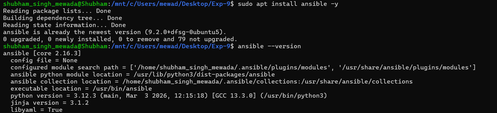
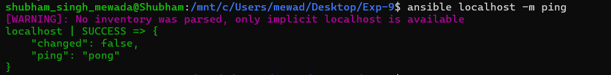
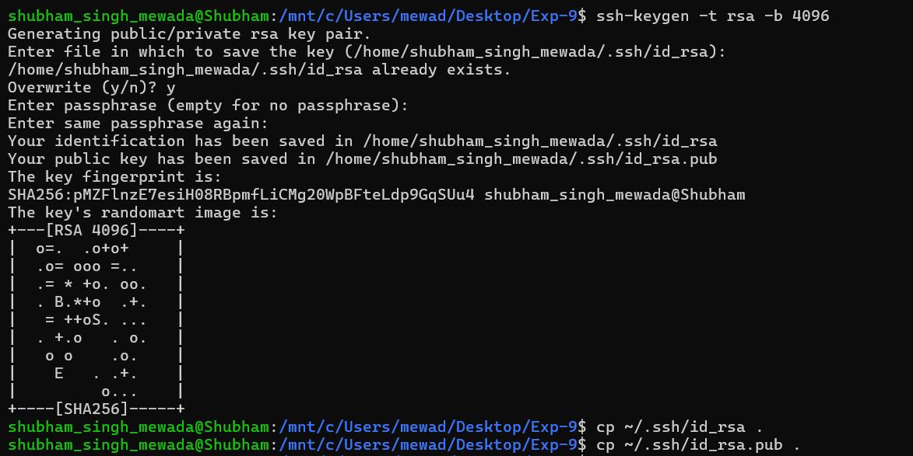
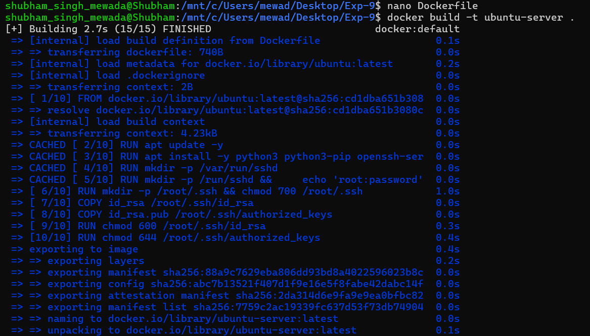
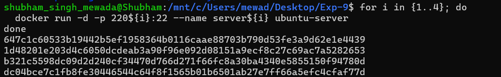
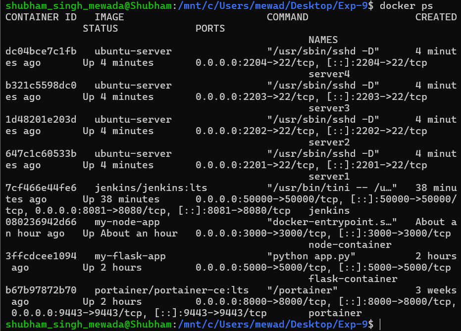
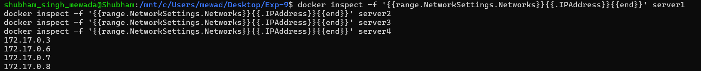
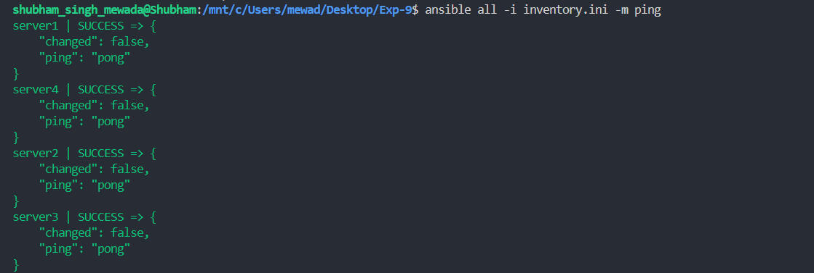
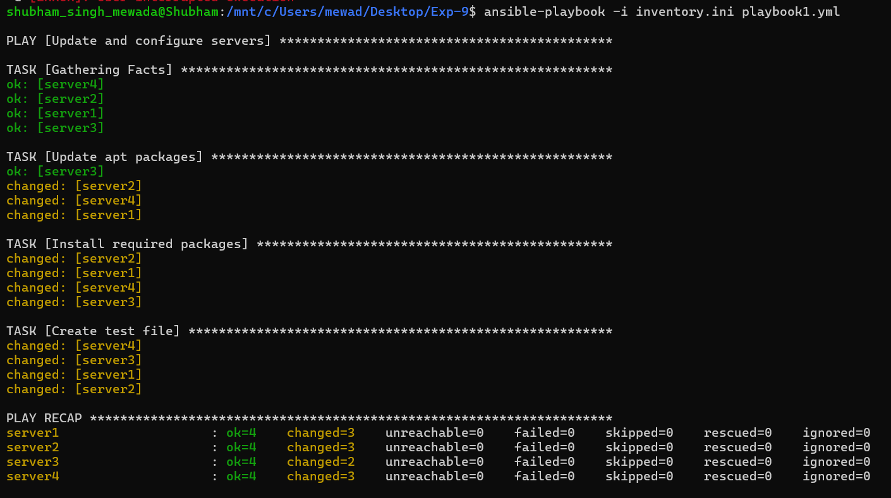
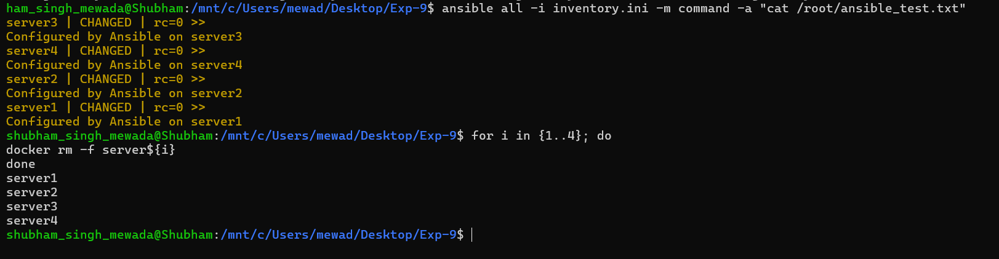

# Experiment 9: Ansible with Docker

## Objective
To understand and implement configuration management using **Ansible** by simulating multiple servers using **Docker** containers.

---

## Theory

Ansible is an open-source automation tool used for configuration management, application deployment, and task automation. It is **agentless** and uses SSH for communication. Tasks are written in YAML-based playbooks which makes automation simple and readable.

### Key Concepts
- **Control Node:** Machine where Ansible is installed.
- **Managed Nodes:** Target systems (Docker containers).
- **Inventory:** A list or group of managed nodes.
- **Playbook:** A YAML file defining the desired state or tasks.
- **Modules:** Built-in tools like `apt`, `copy`, and `service`.

### Why Ansible?
- Reduces manual work
- Ensures consistency
- Saves time
- Scales easily

---

## Tools Used
- **Ansible**
- **Docker**
- **Ubuntu (WSL/Linux)**

---

## Procedure

### Step 1: Install Ansible and Verify

```bash
sudo apt update -y
sudo apt install ansible -y
ansible --version
```



```bash
ansible localhost -m ping
```



---

### Step 2: Generate SSH Key

```bash
ssh-keygen -t rsa -b 4096
cp ~/.ssh/id_rsa .
cp ~/.ssh/id_rsa.pub .
```



---

### Step 3: Create Dockerfile and Build Docker Image

```bash
nano Dockerfile
docker build -t ubuntu-server .
```



---

### Step 4: Run 4 Server Containers

```bash
for i in {1..4}; do
  docker run -d -p 220${i}:22 --name server${i} ubuntu-server
done
```



---

### Step 5: Verify Running Containers

```bash
docker ps
```



---

### Step 6: Inspect Container IP Addresses

```bash
docker inspect -f '{{range.NetworkSettings.Networks}}{{.IPAddress}}{{end}}' server1
docker inspect -f '{{range.NetworkSettings.Networks}}{{.IPAddress}}{{end}}' server2
docker inspect -f '{{range.NetworkSettings.Networks}}{{.IPAddress}}{{end}}' server3
docker inspect -f '{{range.NetworkSettings.Networks}}{{.IPAddress}}{{end}}' server4
```



---

### Step 7: Test Ansible Connectivity

```bash
ansible all -i inventory.ini -m ping
```



---

### Step 8: Create and Run Playbook

Create a file named `playbook1.yml`:

```yaml
---
- name: Update and configure servers
  hosts: all
  become: yes
  tasks:
    - name: Update apt packages
      apt:
        update_cache: yes
        upgrade: dist
    - name: Install required packages
      apt:
        name: ["vim", "htop", "wget"]
        state: present
    - name: Create test file
      copy:
        dest: /root/ansible_test.txt
        content: "Configured by Ansible on {{ inventory_hostname }}"
```

```bash
ansible-playbook -i inventory.ini playbook1.yml
```



---

### Step 9: Verify Output and Cleanup

```bash
ansible all -i inventory.ini -m command -a "cat /root/ansible_test.txt"
```

```bash
for i in {1..4}; do docker rm -f server${i}; done
```



---

## Result

- Ansible installed and verified (core 2.16.3)
- SSH key pair generated and copied to working directory
- `ubuntu-server` Docker image built with SSH support
- 4 Docker containers launched simulating managed nodes (server1–server4)
- All containers successfully pinged via Ansible
- Playbook executed: apt updated, packages installed, test file created on all 4 servers
- Output verified and containers cleaned up

---

## Conclusion

Ansible simplifies server management by automating tasks and ensuring consistency across multiple systems. Using Docker containers as managed nodes allowed simulation of a real multi-server environment without needing physical machines.

## Key Takeaways
- Ansible is agentless and uses SSH for communication
- Playbooks written in YAML automate tasks across all managed nodes
- Docker containers can effectively simulate managed servers
- Inventory files define which hosts Ansible targets
